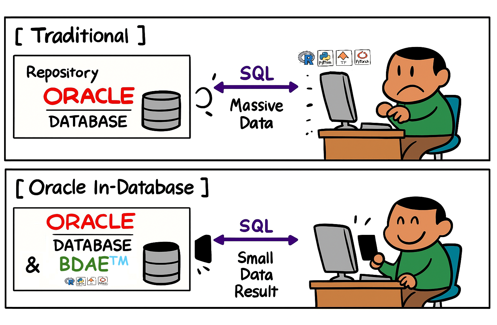

# BDAE (Big Data Analysis Enabler)


## To run ..
1. Register your model in Oracle Database's table or PYTHONPATH directory.
2. Register the SQL to mix source data and your model.
3. Just Run the SQL and get the results.


## Your Python module

You must make entry function of module, for example describe().
others are helper functions.

```python
import numpy as np
import os
import matplotlib as mpl
import matplotlib.pyplot as plt
import pandas as pd
import tempfile
import base64
from pandas.plotting import scatter_matrix

def make_output(df, key, data):
   df[key] = data
   return df

def image_to_html():
   tmp_file_name = tempfile.NamedTemporaryFile().name + '.png'
   plt.savefig(tmp_file_name)
   image = open(tmp_file_name, 'rb')
   image_read = image.read()
   image_64_encode = base64.b64encode(image_read)
   uri = ''
   html_str = "<html><body>" + uri + "</body></html>"
   if os.path.exists(tmp_file_name):
      os.remove(tmp_file_name)
   return html_str

def describe(housing):
   # 0) Prepare Output
   tupleStart = {'subject': [ 'General ML' ] }
   pdf = pd.DataFrame(tupleStart)

   # 1) Historam
   housing.hist(bins=50, figsize=(20,15))
   a = image_to_html()
   pdf = make_output(pdf, 'Histogram', a)

   # 2) Scatter Plot
   housing.plot(kind="scatter", x="LONGITUDE", y="LATITUDE", alpha=0.4,
             s=housing["POPULATION"]/100, label="POPULATION", figsize=(10,7),
             c="MEDIAN_HOUSE_VALUE", cmap=plt.get_cmap("jet"), colorbar=True,
             sharex=False)
   plt.legend()
   a = image_to_html()
   pdf = make_output(pdf, 'ScatterPlot', a)

   # 3) Scatter Matrix
   attributes = ["MEDIAN_HOUSE_VALUE", "MEDIAN_INCOME", "TOTAL_ROOMS",
              "HOUSING_MEDIAN_AGE"]
   scatter_matrix(housing[attributes], figsize=(12, 8))
   a = image_to_html()
   pdf = make_output(pdf, 'ScatterMatrix', a)
   
   return pdf

```

## Your SQL to run
The input (Oracle Database's Table or View or Queries) is delivered pandas DataFrame format to your python entry point function,
and You must make the results into pandas DataFrame format ! because of Oracle In-Database ...

```sql
SELECT * 
      FROM table(apTableEval(
         	cursor(select * from CAL_HOUSING),
         	NULL,
            'SELECT CAST(''A'' AS VARCHAR2(40)) SUBJECT, 
                  TO_CLOB(NULL) H1, TO_CLOB(NULL) H2, TO_CLOB(NULL) H3 
             FROM DUAL',
           'CAL_HOUSING_EDM:describe'))
```

## Results
Like General SQL Queries' results, BDAE's results are the same.

