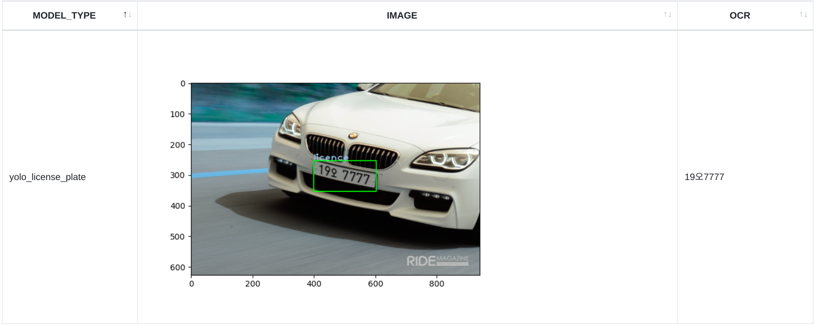

## How to infer(predict) with stored model information

for example, make your table like

```
Table Name : PYTHON_SER 
Name    Null? Type         
------- ----- ------------ 
KEY           VARCHAR2(40) 
RAWDATA       BLOB          ....... Model Binary Data   
YN            VARCHAR2(40)
------- ----- ------------ 
```

SQL
```
SELECT *
FROM table(apTableEval(
    cursor(SELECT '/home/oracle/yolo/car_2.jpg' AS DATA
           FROM dual), -- Data to infer(predict) X target data
    cursor(SELECT * FROM python_ser WHERE key = 'yolo_paddle'),  -- Model Serialized Table Record
    -- below SQL output (Table or View .. )
    'SELECT CAST(''A'' AS VARCHAR2(40)) MODEL_TYPE, TO_CLOB(NULL) IMAGE, CAST(''A'' AS VARCHAR2(40)) OCR FROM dual',
    'YOLOv8:predict_with_model') -- Python Module and Function
)
```

Python Module

```
def image_to_html():
   tmp_file_name = tempfile.NamedTemporaryFile().name + '.png'
   plt.savefig(tmp_file_name)
   image = open(tmp_file_name, 'rb')
   image_read = image.read()
   image_64_encode = base64.b64encode(image_read)
   uri = ''
   html_str = "<html><body>" + uri + "</body></html>"
   if os.path.exists(tmp_file_name):
      os.remove(tmp_file_name)
   return html_str

def predict_with_model(df_data, df_model):
   
   model_binary = df_model['RAWDATA'].values
   fh.close()
   logger.removeHandler(fh)
   
   #logging.info('type : {}'.format(str(type(model_binary)))
   with open("/home/oracle/yolo/yolo_paddle_test.pt", "wb") as f:
      f.write(model_binary[0])
      f.close()
      
      
   os.chdir('/home/oracle/yolo')
   model = YOLO('yolo_paddle_test.pt')
   img = cv2.imread(df_data['DATA'])
   results = model.predict(img, save=False, conf=0.5)
   color1 = (155, 200, 230)
   img_crop = None
   for result in results:
      boxes = result.boxes.cpu().numpy()  # Get boxes on CPU in numpy format
      for box in boxes:
         r = box.xyxy[0].astype(int)
         class_id = int(box.cls[0])  # Get class ID
         class_name = model.names[class_id]  # Get class name using the class ID
         cv2.rectangle(img, r[:2], r[2:], (0, 255, 0), 2)  # Draw boxes on the image
         cv2.putText(img, class_name, (r[0], r[1]), 1, 2, color1, 2, cv2.LINE_AA)
         img_crop = img[r[:2], r[2:]].copy()
   plt.imshow(img)
   plt.savefig('/tmp/result.png')
   img_crop =  img[r[1]:r[3], r[0]:r[2]].copy()  
   ocr = PaddleOCR(lang="korean")
   result = ocr.ocr(img_crop, cls=False)
   ocr_result = result[0]
   license_x = ''
   for rectObj in ocr_result:
      for rect in rectObj:
         if isinstance(rect, list):
            pt1 = tuple([int(s) for s in rect[0]])
            pt2 = (int(rect[1][0]), int(rect[3][1]))
         if isinstance(rect, tuple):
            license_x = license_x + rect[0]
            

   color1 = (155, 200, 230)
   img2html = image_to_html()
   dataDict ={'Model': [df_model['KEY'][0]], 'IMG' : [img2html], 'OCR': [license_ocr]}
   pdf = pd.DataFrame(dataDict)
   return (pdf)
```

Result


