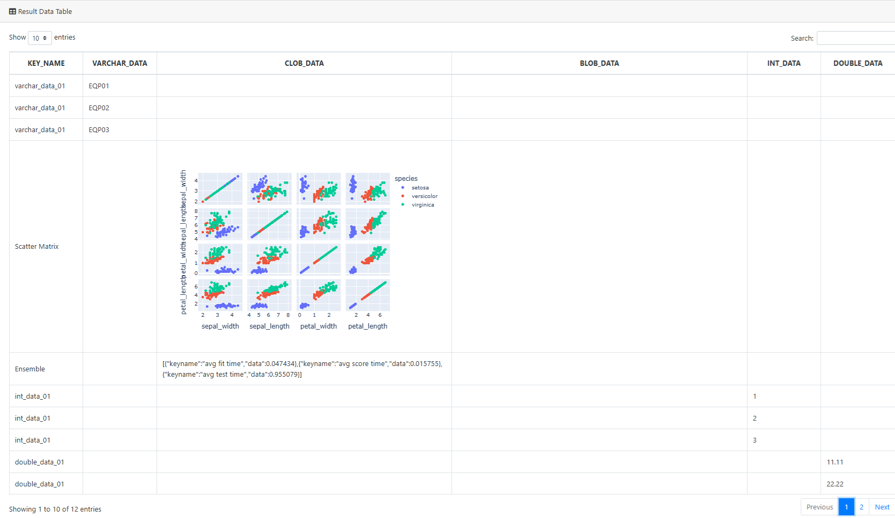
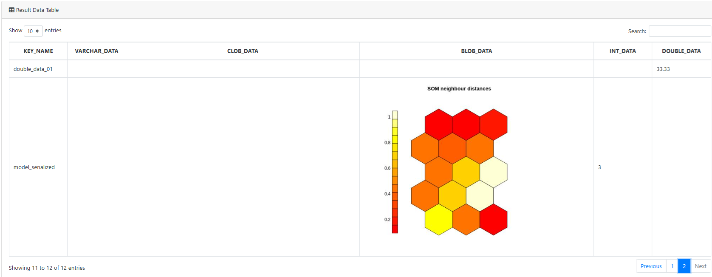

### Python All Output in One Dataframe.

```
import plotly.express as px
import matplotlib.pyplot as plt
import plotly.offline as py
import pandas as pd
import os
import tempfile
import numpy as np
import plotly.graph_objects as go

def display():
    key_name = []
    varchar_data = []
    clob_data = []
    blob_data = []
    int_data = []
    double_data = []

    # varchar data
    sample = ['EQP01','EQP02','EQP03']
    for i in range(len(sample)):
        key_name.append('varchar_data_01')
        varchar_data.append(sample[i])
        clob_data.append(np.nan)
        blob_data.append(np.nan)
        int_data.append(np.nan)
        double_data.append(np.nan)

    # clob_data like image or something
    df = px.data.iris()
    fig = px.scatter_matrix(df, dimensions=["sepal_width", "sepal_length", "petal_width", "petal_length"], color="species")
    chartData = py.offline.plot(fig, output_type='div')

    key_name.append('Scatter Matrix')
    varchar_data.append(np.nan)
    clob_data.append(chartData)
    blob_data.append(np.nan)
    int_data.append(np.nan)
    double_data.append(np.nan)
    
    # clob for ML/DL results set to json
    dictData = {'keyname': ['avg fit time','avg score time', 'avg test time'], 'data': [0.047434, 0.015755, 0.955079] }
    mlResult = pd.DataFrame(dictData)
    mlResultJson = mlResult.to_json(orient='records')

    key_name.append('Ensemble')
    varchar_data.append(np.nan)
    clob_data.append(mlResultJson)
    blob_data.append(np.nan)
    int_data.append(np.nan)
    double_data.append(np.nan)

    # int data
    sample_integer = [1,2,3]
    for i in range(len(sample_integer)):
        key_name.append('int_data_01')
        varchar_data.append(np.nan)
        clob_data.append(np.nan)
        blob_data.append(np.nan)
        int_data.append(sample_integer[i])
        double_data.append(np.nan)
    
    sample_double = [11.11, 22.22, 33.33]
    for i in range(len(sample_double)):
        key_name.append('double_data_01')
        varchar_data.append(np.nan)
        clob_data.append(np.nan)
        blob_data.append(np.nan)
        int_data.append(np.nan)
        double_data.append(sample_double[i])
    
    f = open('/home/oracle/Pictures/kohonen03.jpg', mode="rb")
    image_data = f.read()
    key_name.append('model_serialized')
    varchar_data.append(np.nan)
    clob_data.append(np.nan)
    blob_data.append(image_data)
    int_data.append(sample_integer[i])
    double_data.append(np.nan)  

    dictData = {'Key': key_name, 'VARCHAR_DATA': varchar_data, 'CLOB_DATA': clob_data, 'BLOB_DATA': blob_data, 'INT_DATA': int_data, 'DOUBLE_DATA': double_data}
    pdf = pd.DataFrame(dictData)
    return pdf
```

```
SELECT *
FROM table(apEval(
   NULL,
   'SELECT CAST(''A'' AS VARCHAR2(40)) KEY_NAME, 
           CAST(''A'' AS VARCHAR2(1000)) VARCHAR_DATA,
           TO_CLOB(NULL) CLOB_DATA,
           TO_BLOB(NULL) BLOB_DATA,
           1.0 INT_DATA,
           1.0 DOUBLE_DATA
    FROM dual',
   'Model_Output_Example:display'))
```


