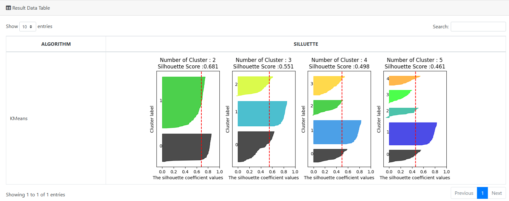

### Python Image File Return not base64

DBSCAN simple algorithm
```
import numpy as np
import pandas as pd
from sklearn.cluster import DBSCAN
from sklearn import metrics
from sklearn.datasets import make_blobs
from sklearn.preprocessing import StandardScaler
import matplotlib
import gc
matplotlib.use('Agg') 
import matplotlib.pyplot as plt

from matplotlib import style
import os
import sys
import urllib
import base64

def dbscan():
    centers = [[1, 1], [-1, -1], [1, -1]]
    X, labels_true = make_blobs(n_samples=750, centers=centers, cluster_std=0.4,
                    random_state=0)

    X = StandardScaler().fit_transform(X)

    db = DBSCAN(eps=0.3, min_samples=10).fit(X)
    core_samples_mask = np.zeros_like(db.labels_, dtype=bool)
    core_samples_mask[db.core_sample_indices_] = True
    labels = db.labels_

    n_clusters_ = len(set(labels)) - (1 if -1 in labels else 0)


    unique_labels = set(labels)
    colors = [plt.cm.Spectral(each)
          for each in np.linspace(0, 1, len(unique_labels))]
    for k, col in zip(unique_labels, colors):
        if k == -1:
            col = [0, 0, 0, 1]
        class_member_mask = (labels == k)
        xy = X[class_member_mask & core_samples_mask]
        plt.plot(xy[:, 0], xy[:, 1], 'o', markerfacecolor=tuple(col),
                markeredgecolor='k', markersize=14)

        xy = X[class_member_mask & ~core_samples_mask]
        plt.plot(xy[:, 0], xy[:, 1], 'o', markerfacecolor=tuple(col),
                markeredgecolor='k', markersize=6)

    plt.title('Estimated number of clusters: %d' % n_clusters_)
    plt.savefig('/tmp/kmeans.png')

    ## Image itself .. BLOB of Oracle Type.
    image = open('/tmp/kmeans.png', 'rb')
    image_read = image.read()

    ## Base64 
    ##image_64_encode = base64.b64encode(image_read)
    ##print(type(image_64_encode))

    ##uri = ''
    ##total = "<html><body>" + uri + "</body></html>"

    ##f = open("/tmp/james02.html", "w")
    ##f.write(total)
    ##f.close()
    
    blob_data = []
    blob_data.append(image_read)
    list_data1 = [n_clusters_]
    list_data2 = [metrics.homogeneity_score(labels_true, labels)]
    #list_data3 = [total]
    blog_file_name = ['/tmp/cluster_image_01.png']

    datax ={'Estimate No. Clusters': list_data1, 'Homogeneity': list_data2, 'Image Name':blog_file_name, 'IMG' : blob_data}
    pdf = pd.DataFrame(datax)
    del X
    del db
    #del image_64_encode
    #del uri
    gc.collect()
    return (pdf)
```

SQL to invoke
```
SELECT *
FROM table(apEval(
   NULL,
   'SELECT 1.0 ClusterNo, 1.0 Homogeneity, CAST(''AA'' AS VARCHAR2(100)) FileName, TO_BLOB(NULL) IMAGE FROM dual',
   'DBSCAN_IMG:dbscan'))
```

### Image File to Base64 manually.

```
from sklearn.preprocessing import scale
from sklearn.datasets import load_iris
from sklearn.cluster import KMeans
# 실루엣 분석 metric 값을 구하기 위한 API 추가
from sklearn.metrics import silhouette_samples, silhouette_score
import matplotlib.pyplot as plt
import numpy as np
import pandas as pd
from matplotlib import style
import os
import sys
import urllib
import base64
import warnings
warnings.filterwarnings('ignore')

def visualize_silhouette(cluster_lists, X_features): 
    
    from sklearn.datasets import make_blobs
    from sklearn.cluster import KMeans
    from sklearn.metrics import silhouette_samples, silhouette_score

    import matplotlib.pyplot as plt
    import matplotlib.cm as cm
    import math
    
    # 입력값으로 클러스터링 갯수들을 리스트로 받아서, 각 갯수별로 클러스터링을 적용하고 실루엣 개수를 구함
    n_cols = len(cluster_lists)
      
    # plt.subplots()으로 리스트에 기재된 클러스터링 수만큼의 sub figures를 가지는 axs 생성 
    fig, axs = plt.subplots(figsize=(3*n_cols, 4), nrows=1, ncols=n_cols)
    
    # 리스트에 기재된 클러스터링 갯수들을 차례로 iteration 수행하면서 실루엣 개수 시각화
    for ind, n_cluster in enumerate(cluster_lists):
        clusterer = KMeans(n_clusters = n_cluster, max_iter=500, random_state=0)
        cluster_labels = clusterer.fit_predict(X_features)
        sil_avg = silhouette_score(X_features, cluster_labels)
        sil_values = silhouette_samples(X_features, cluster_labels)
        y_lower = 10
        axs[ind].set_title('Number of Cluster : '+ str(n_cluster)+'\n' \
                          'Silhouette Score :' + str(round(sil_avg,3)) )
        axs[ind].set_xlabel("The silhouette coefficient values")
        axs[ind].set_ylabel("Cluster label")
        axs[ind].set_xlim([-0.1, 1])
        axs[ind].set_ylim([0, len(X_features) + (n_cluster + 1) * 10])
        axs[ind].set_yticks([])  # Clear the yaxis labels / ticks
        axs[ind].set_xticks([0, 0.2, 0.4, 0.6, 0.8, 1])
         
        for i in range(n_cluster):
            ith_cluster_sil_values = sil_values[cluster_labels==i]
            ith_cluster_sil_values.sort()
            
            size_cluster_i = ith_cluster_sil_values.shape[0]
            y_upper = y_lower + size_cluster_i
            
            color = cm.nipy_spectral(float(i) / n_cluster)
            axs[ind].fill_betweenx(np.arange(y_lower, y_upper), 0, ith_cluster_sil_values, \
                                facecolor=color, edgecolor=color, alpha=0.7)
            axs[ind].text(-0.05, y_lower + 0.5 * size_cluster_i, str(i))
            y_lower = y_upper + 10
            
        axs[ind].axvline(x=sil_avg, color="red", linestyle="--")

    plt.savefig('/tmp/silluette.png')
    image = open('/tmp/silluette.png', 'rb')
    image_read = image.read()
    image_64_encode = base64.b64encode(image_read)
    print(type(image_64_encode))

    uri = ''
    total = "<html><body>" + uri + "</body></html>"
    list_label = ['KMeans']
    list_base64_image = [total]
    dataDict ={'Algorithm': list_label, 'Image' : list_base64_image}
    pdf = pd.DataFrame(dataDict)
    return (pdf)
    
def visual_silluette():
    iris=load_iris()
    return visualize_silhouette([ 2, 3, 4,5 ], iris.data)

```
SQL
```
SELECT *
FROM table(apEval(
   NULL,
   'SELECT CAST(''AA'' AS VARCHAR2(40)) Algorithm, TO_CLOB(NULL) Silluette FROM dual',
   'Clustering:visual_silluette'))
```

