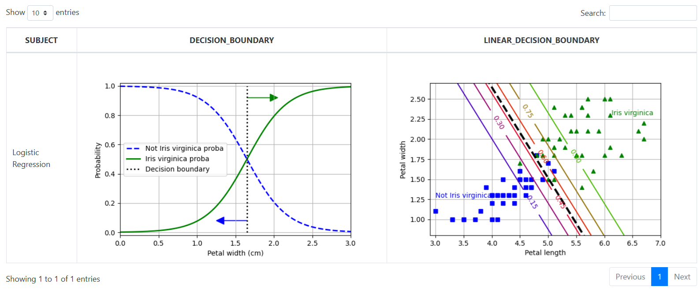

### Logistics

```
import pandas as pd
from sklearn.linear_model import LogisticRegression
from sklearn.model_selection import train_test_split
import matplotlib.pyplot as plt
import numpy as np
import tempfile
import os
import base64
import BDAELogger as BDAE

def make_output(df, key, data):
    df[key] = data
    return df

def image_to_html():
    tmp_file_name = tempfile.NamedTemporaryFile().name + '.png'
    plt.savefig(tmp_file_name)
    image = open(tmp_file_name, 'rb')
    image_read = image.read()
    image_64_encode = base64.b64encode(image_read)
    uri = ''
    html_str = "<html><body>" + uri + "</body></html>"
    if os.path.exists(tmp_file_name):
        os.remove(tmp_file_name)
    return html_str

def decideBoundary(df):
    BDAELogger = BDAE.BDAELogger('LogisticReg:decideBoundary')
    print('---- start ----')
    y = df['TARGET'] == 'virginica'
    X = df['PETAL_WIDTH'].values.reshape(-1,1)
    print('train_test_split() .. ')
    X_train, X_test, y_train, y_test = train_test_split(X,y,random_state=42)
    log_reg = LogisticRegression(random_state=42)
    log_reg.fit(X_train, y_train)
    # Decision Boundary
    print('plot preparing .. ')
    X_new = np.linspace(0, 3, 1000).reshape(-1, 1)  # 크기를 바꾸어 열 벡터를 얻습니다.
    y_proba = log_reg.predict_proba(X_new)
    decision_boundary = X_new[y_proba[:, 1] >= 0.5][0, 0]
    plt.figure(figsize=(6, 4))  # 추가 코드
    plt.plot(X_new, y_proba[:, 0], "b--", linewidth=2,
         label="Not Iris virginica proba")
    plt.plot(X_new, y_proba[:, 1], "g-", linewidth=2, label="Iris virginica proba")
    plt.plot([decision_boundary, decision_boundary], [0, 1], "k:", linewidth=2,
         label="Decision boundary")

    # 추가 코드 - 이 섹션에서는 그림 4-23을 꾸미고 저장합니다.
    plt.arrow(x=decision_boundary, y=0.08, dx=-0.3, dy=0,
          head_width=0.05, head_length=0.1, fc="b", ec="b")
    plt.arrow(x=decision_boundary, y=0.92, dx=0.3, dy=0,
          head_width=0.05, head_length=0.1, fc="g", ec="g")
    plt.plot(X_train[y_train == 'setosa'], y_train[y_train == 'setosa'], "bs")
    plt.plot(X_train[y_train == 'versicolor'], y_train[y_train == 'versicolor'], "g^")
    plt.xlabel("Petal width (cm)")
    plt.ylabel("Probability")
    plt.legend(loc="center left")
    plt.axis([0, 3, -0.02, 1.02])
    plt.grid()
    print('make return dataframe ..')
    tupleStart = {'subject': [ 'Logistic Regression' ] }
    pdf = pd.DataFrame(tupleStart)
    a = image_to_html()
    pdf = make_output(pdf, 'Decision Boundary', a)
    
    X = df.loc[:,['PETAL_LENGTH','PETAL_WIDTH']].values
    
    X_train, X_test, y_train, y_test = train_test_split(X, y, random_state=42)

    log_reg = LogisticRegression(C=2, random_state=42)
    log_reg.fit(X_train, y_train)

    # 등고선 그래프
    x0, x1 = np.meshgrid(np.linspace(2.9, 7, 500).reshape(-1, 1),
                     np.linspace(0.8, 2.7, 200).reshape(-1, 1))
    X_new = np.c_[x0.ravel(), x1.ravel()]  # 그림의 포인트당 하나의 샘플
    y_proba = log_reg.predict_proba(X_new)
    zz = y_proba[:, 1].reshape(x0.shape)

    # 결정 경계
    left_right = np.array([2.9, 7])
    boundary = -((log_reg.coef_[0, 0] * left_right + log_reg.intercept_[0])
             / log_reg.coef_[0, 1])

    plt.figure(figsize=(6, 4))
    plt.plot(X_train[y_train == 0, 0], X_train[y_train == 0, 1], "bs")
    plt.plot(X_train[y_train == 1, 0], X_train[y_train == 1, 1], "g^")
    contour = plt.contour(x0, x1, zz, cmap=plt.cm.brg)
    plt.clabel(contour, inline=1)
    plt.plot(left_right, boundary, "k--", linewidth=3)
    plt.text(3.5, 1.27, "Not Iris virginica", color="b", ha="center")
    plt.text(6.5, 2.3, "Iris virginica", color="g", ha="center")
    plt.xlabel("Petal length")
    plt.ylabel("Petal width")
    plt.axis([2.9, 7, 0.8, 2.7])
    plt.grid()

    a = image_to_html()
    pdf = make_output(pdf, 'Linear Decision Boundary', a)

    return pdf
```

```
SELECT * 
      FROM table(apTableEval(
         	cursor(select * from IRIS),
         	NULL,
            'SELECT CAST(''A'' AS VARCHAR2(40)) SUBJECT, 
                  TO_CLOB(NULL) DECISION_BOUNDARY, TO_CLOB(NULL) LINEAR_DECISION_BOUNDARY
             FROM DUAL',
           'LogisticReg:decideBoundary'))
```

