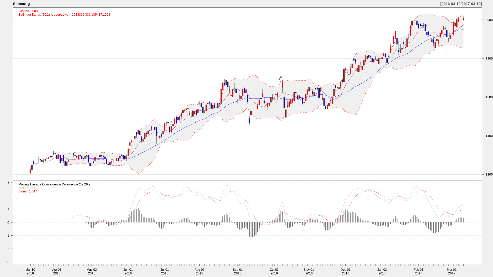

### R Coding Style for BDAE

이 형태의 것을 추천한다. 그 이유는 다양한 함수들을 만들고 즉시 호출하면서 <br>
마치 개발할 때와 동일한 형태를 유지할 수 있기 때문이다. <br><br>

단, data, args 를 변수명으로 사용하지 말자. 이 두개는 BDAE 가 사용한다.
```
library(logr)

log_open("/tmp/rlog.log")
log_print('------ start -------')
log_print(str(data))
log_print(str(args))

# your own function
my <- function() {
   a <- 99.99  
   return (a)
}

aa = c('aaaaaaaaaa','ccccccc')

# call your function
k <- my()
bb = c(k, 22.12)

df <- data.frame(A=aa,B=bb,stringsAsFactors=FALSE)
kkk <- 939.999
df

```

KOSPI
```
## KOSPI, NEW_TYPE
# RSCRIPT.STYLE_TYPE != Normal, Input Data -> data, Arguments -> args are fixed.
library(xts)
library(quantmod)
library(RCurl)
library(logr)
library(xts)
library(quantmod)
library(RCurl)

sma1 = args$SMA1
sma2 = args$SMA2

data2 <- data.frame(data$open,data$high, data$low, data$close, data$volume, data$adjusted, row.names=data$row.names)
s1 <- as.xts(data2)
png(tf1 <- tempfile(fileext = ".png"), width=1920, height=1080)
taS <- sprintf("addMACD();addBBands();addSMA(%d);addSMA(%d,col='blue')", sma1[[1]],sma2[[1]])
chartSeries(s1['2016-03-10::'], up.col='red',dn.col='blue',theme='white',name="Samsung",TA=taS)
dev.off()

rm(data)
rm(data2)
df <- data.frame(a=tf1,stringsAsFactors=FALSE)
lraw.lst <- vector("list", 1)
lraw.lst[[1L]] <- readBin(tf1, "raw", file.info(tf1)[1, "size"])
unlink(tf1)
df$blob <- lraw.lst
df
```

SQL
```
SELECT * 
      FROM 
        table(asTableEval( 
          cursor(SELECT * FROM KSPI), 
          cursor(SELECT 10 AS SMA1, 30 AS SMA2 FROM DUAL),
          'SELECT CAST(''A'' AS VARCHAR2(40)) PATH, 
                  TO_BLOB(NULL) img 
           FROM dual', 
          'Kospi_NEW_TYPE'))
```

