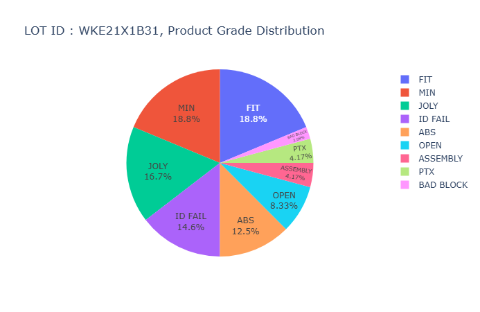

### Smart Factory Example

설비 유의차
```
import os
import sys
import urllib
import base64
import pandas as pd
import plotly.express as px
import plotly.offline as py

def display(df):
    fig = px.box(df, x="MACHINE_ID", y="YIELD", color='MACHINE_ID',
             notched=True, # used notched shape
             title="Yield Machine Significant",
             hover_data=["DAY"] # add day column to hover data
            )
    total = py.offline.plot(fig, output_type='div')
    return total
```

SQL
```
SELECT *
FROM table(apTableEval(
   CURSOR(SELECT
          MACHINE_ID, OUT_QTY AS YIELD, 
          TO_CHAR(TKIN_TIME, 'yyyy-mm-dd') DAY 
          FROM lot_sum WHERE MACHINE_ID like '24%'),
   NULL,
   'XML',
   'EquipSignifi:display'))
```


```
import os
import sys
import urllib
import base64
import pandas as pd
import plotly.express as px
import plotly.offline as py
from StreamToLogger import StreamToLogger
import logging, logging.handlers

def display(df):
    
    logger = logging.getLogger('LOTSUM_ERR_PIE:display')
    logger.setLevel(logging.DEBUG)
    
    socketHandler = logging.handlers.SocketHandler('localhost',
                    logging.handlers.DEFAULT_TCP_LOGGING_PORT)
    
    logger.addHandler(socketHandler)
    
    sys.stdout = StreamToLogger(logger,logging.INFO)
    sys.stderr = StreamToLogger(logger,logging.ERROR)
    
    print('-------- LOTSUM_ERROR_PIE start ---------')
    print(str(df.head(6)))
    fig = px.pie(df, values='CNT', names='PROD_GRADE_DESC', title='LOT ID : ' + df['LOT_ID'][0] + ', Product Grade Distribution')
    fig.update_traces(textposition='inside', textinfo='percent+label')
    total = py.offline.plot(fig, output_type='div')
    print('-------- LOTSUM_ERROR_PIE end ---------')
    return (total)
```

```
WITH LOT_SUM_ONE AS (
   SELECT LOT_ID, 
     CASE WHEN PROD_GRADE = 9 THEN 'BAD BLOCK'
              WHEN PROD_GRADE = 8 THEN 'ASSEMBLY'
              WHEN PROD_GRADE = 7 THEN 'PTX'
              WHEN PROD_GRADE = 6 THEN 'ID FAIL'
              WHEN PROD_GRADE = 5 THEN 'OPEN'
              WHEN PROD_GRADE = 4 THEN 'ABS'
              WHEN PROD_GRADE = 3 THEN 'JOLY'
              WHEN PROD_GRADE = 2 THEN 'FIT'
              WHEN PROD_GRADE = 1 THEN 'MIN'
              ELSE
                 'N/A'
         END PROD_GRADE_DESC
     , COUNT(PROD_GRADE) CNT from table (
        productExplodeEvalCLob(cursor(
           SELECT * FROM LOT_SUM WHERE LOT_ID = 'WKE21X1B31' AND MACHINE_ID = '48PARA-03' AND DURABLE_ID = 'Z718'))) GROUP BY LOT_ID, PROD_GRADE
 )
SELECT *
  FROM table(apTableEval(
   cursor(
     SELECT * FROM LOT_SUM_ONE
   ),
   NULL,
   'XML',
   'LOTSUM_ERR_PIE:display'))
```


