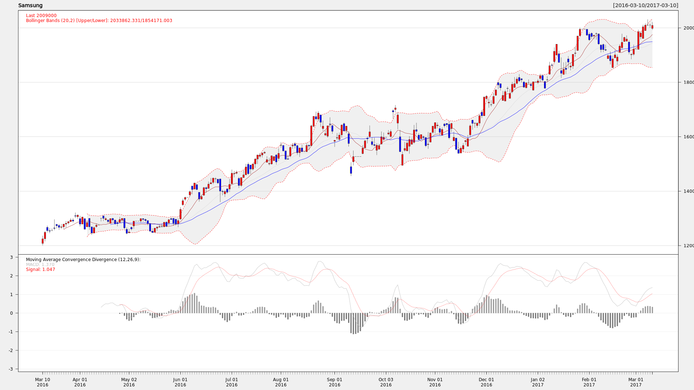

## BDAE R Basic
Analysts typically use R Studio or Jupyter Notebook for R development. Of Course, Other tools are available.<br>
Since development is interactive, you can simply copy and paste the data into BDAE Web, name it, and save it. <br>

There are four table functions for R in BDAE.
1. asEval (SQL_args, SQL_output, R_module_name)
2. asRowEval (SQL_input, SQL_args, SQL_output, No_Of_Rows, R_module_name)
3. asTableEval (SQL_input, SQL_args, SQL_output, R_module_name)
4. asGroupEval (SQL_input, SQL_args, SQL_output, 'col1,col2,col3..', R_module_name)

Except for ***asEval()***, there is a ***SQL_input*** to be analyzed. Since the data exists in an Oracle database, ***SQL_input*** is described in the form of a SQL Query, and this must be a SQL statement that can be queried independently.<br>

***SQL_args*** can be hyperparameters, arguments of reusable functions, or the Reference Data itself. For simple parameters, use SELECT .. FROM dual. For Reference Data, enter the corresponding Query.<br>
***SQL_output*** can be entered as SELECT .. FROM dual, or directly as the table name or view name, but the reason for including the output like this is due to the procedure of how SQL is executed within Oracle Database, so there is no other way. However, this format and the return format of the R data.frame must be the same. This part can be generated through a utility. <br>
***R_module_name*** is the name the analyst saves his R script as, and must be a unique name. <br>
***asRowEval()*** means to repeatedly call ***R_module_name*** every ***a certain number of rows*** and pass back all the results. No_Of_Rows must be an integer.<br>
***asGroupEval()*** The ***col1,col2,...*** parts correspond to Group By, which means that there is no need to Group By in ***SQL_input***. In other words, Oracle Database automatically reacts to this, Group Bys the data, and then passes it to BDAE, and BDAE calls ***R_module_name*** for each part.<br>
***asTableEval()*** is the most commonly used, and when parallel processing is needed, ***asGroupEval()*** can be used. In that case, ***R_module_name*** can be reused.

## BDAE R Example
### Infinity and NaN
1. Save below R code as R_infinity (As you want.)
```
X <- c(1,2,3,NA,5)
Y <- c(1.1,-1.0/0,1.0/0,4.0,5.34)

df <- data.frame(X,Y)
df
```
2. Make SQL to run above R script
```
SELECT A, case when B=-binary_double_infinity then '-Infinity' 
               when B=binary_double_infinity then '+Infinity'
               else TO_CHAR(B) END AS B FROM (
 SELECT *
   FROM
   table(asEval(
   NULL,
   'SELECT 1 as A, 1.0 as B FROM dual',
   'R_infinity'))
)
```
3. After run above SQL, results are as followings.<br>

|A	|B        |
|---|---------|
|1	|1.1      |
|2	|-Infinity|
|3	|+Infinity|
|4  |         |
|5	|5.34     |

### Data Type
1. Save below R code as R_date.

In case of DateTime, use followings
    
    date_time <- as.POSIXct("2015-10-19 10:15")

```
function() {
   emp.data <- data.frame(
   emp_id = c (1:5), 
   emp_name = c("Rick","Dan","Michelle","Ryan","Gary"),
   salary = c(623.3,515.2,611.0,729.0,843.25), 
   
   start_date = as.Date(c("2012-01-01", "2013-09-23", "2014-11-15", "2014-05-11",
      "2015-03-27")),
   stringsAsFactors = FALSE
   )
   emp.data$start_date <- as.character(emp.data$start_date)

   return (emp.data)
}
```
2. Make SQL to run above R script

```
   SELECT * 
   FROM 
   table(asEval( 
   NULL, 
   'SELECT 1 as emp_id, CAST(''A'' AS VARCHAR2(40)) emp_name, 
           1.0 as salaray,  CAST(''A'' AS VARCHAR2(40)) start_date
    FROM dual', 
   'R_date'))
```

3. Results

| EMP_ID |	EMP_NAME |	SALARAY |	START_DATE |
|--------|-----------|----------|--------------|
| 1      |	Rick   	 | 623.3	| 2012-01-01   |
| 2	     |  Dan	     | 515.2	| 2013-09-23   |
| 3	     |  Michelle |	611	    | 2014-11-15   |
| 4	     |  Ryan     |	729	    | 2014-05-11   |
| 5	     |  Gary	 | 843.25	| 2015-03-27   |

### asTableEval and Picture Handling

1. R Script

Save below R codes as R_kospi.

```
## KOSPI, NewType
# RSCRIPT.STYLE_TYPE != Normal, Input Data -> data, Arguments -> args are fixed.
library(xts)
library(quantmod)
library(RCurl)
library(logr)
library(xts)
library(quantmod)
library(RCurl)

sma1 = args$SMA1
sma2 = args$SMA2

data2 <- data.frame(data$open,data$high, data$low, data$close, data$volume, data$adjusted, row.names=data$row.names)
s1 <- as.xts(data2)
png(tf1 <- tempfile(fileext = ".png"), width=1920, height=1080)
taS <- sprintf("addMACD();addBBands();addSMA(%d);addSMA(%d,col='blue')", sma1[[1]],sma2[[1]])
chartSeries(s1['2016-03-10::'], up.col='red',dn.col='blue',theme='white',name="Samsung",TA=taS)
dev.off()

rm(data)
rm(data2)
df <- data.frame(a=tf1,stringsAsFactors=FALSE)
lraw.lst <- vector("list", 1)
lraw.lst[[1L]] <- readBin(tf1, "raw", file.info(tf1)[1, "size"])
df$blob <- lraw.lst
df
```
2. SQL

```
SELECT * 
      FROM 
        table(asTableEval( 
          cursor(SELECT * FROM KSPI WHERE ... ), 
          cursor(SELECT 10 AS SMA1, 30 AS SMA2 FROM DUAL),
          'SELECT CAST(''A'' AS VARCHAR2(40)) PATH, 
                  TO_BLOB(NULL) img 
           FROM dual', 
          'R_Kospi'))
```

3. Results

